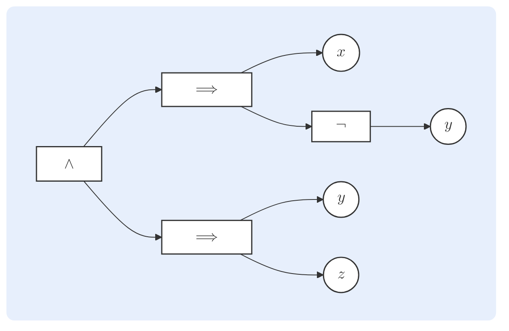

 ##### Содержание
1. Аксиоматика
2. Булевы выражения
3. Булевы операции
4. Законы булевой алгебры

---

$$\hspace{7cm}
\begin{array}{r}
\textit{"Мы почитаем всех нулями, а единицами — себя.”} \\
	\text{— А. С. Пушкин}
\\[-0.8em]
\rule{7cm}{0.3pt}
\end{array}  $$
# Аксиоматика

> [!Info] Определение
> **Булева алгебра** — дополненная дистрибутивная решётка.
>
> Иными словами, булева алгебра — это кортеж $\langle B, \vee, \wedge, \neg, 0, 1 \rangle$, где:
> - $B$ — множество-носитель булевой алгебры;
> - $\vee$, $\wedge$ — бинарные операции ($\text{join}$ и $\text{meet}$);
> - $\neg$ — унарная операция (*дополнение*);
> - $0$, $1$ — константы (*наименьший* и *наибольший* элементы решётки),
> 
> удовлетворяющий 5 группам аксиом.

> **Аксиомы булевой алгебры**
> 
> - коммутативность: $$x \vee y = y \vee x ~~~~~~~~~~~~~~ x \wedge y = y \wedge x$$
> - ассоциативность: $$(x \vee y) \vee z = x \vee (y \vee z) ~~~~~~~~~~~~~~ (x \wedge y) \wedge z = x \wedge (y \wedge z) $$
> - дистрибутивность: $$x \wedge (y \vee z) = (x \wedge y) \vee (x \wedge z) ~~~~~~~~~~~~~~ x \vee (y \wedge z) = (x \wedge y) \vee (x \wedge z) $$
> - идентичность: $$x \vee 0 = x ~~~~~~~~~~~~~~ x \wedge 1 = x $$
> - дополнение: $$x \vee \neg x = 1 ~~~~~~~~~~~~~~ x \wedge \neg x = 0$$

---
# Булевы выражения

> [!Info] Определение
> **Булево выражение** определяется рекурсивно:
> - переменные и константы являются выражениями;
> - если $f$ и $g$ являются выражениями, то также являются выражениями $\neg f$, $\neg g$, $f \land g$, $f \lor g$.
> 
> Каждое выражение задаёт *булеву функцию* $f: B^n \to B$, где $B$ — носитель булевой алгебры.

> [!Important] Виды выражений
> Тождественно истинное выражение $f \equiv 1$ называется **тавтологией**.
> Тождественно ложное выражение $f \equiv 0$ называется **противоречием**.
> Выражений, истинность которого зависит от значений переменных, называется **неопределенностью** (*contingency*).

Булевы выражения можно представлять в виде ориентированных деревьев так, что более глубокая операция будет выполняться раньше. Так, например, выражение $$(x \implies \neg y) \land (y \implies z) $$
примет следующий вид:

# Таблицы истинности

> [!Info] Определение
> **Таблица истинности** — способ формального определения булевой функции, явно сопотавляющий каждому возможному набору переменных результат её применения на нём и группирующий получившиеся данные в формате таблицы: 
> $$\begin{array}{ccc|c} x & y & z & f(x, y, z) \\ \hline 0 & 0 & 0 & 1 \\ 0 & 0 & 1 & 1 \\ 0 & 1 & 0 & 0 \\ 0 & 1 & 1 & 1 \\ 1 & 0 & 0 & 0 \\ 1 & 0 & 1 & 1 \\ 1 & 1 & 0 & 0 \\ 1 & 1 & 1 & 0 \end{array}$$

> [!Info] Определение
> Два булевых выражения называются **эквивалентными**, если их таблицы истинности совпадают.

---
# Булевы операции

## Простые операции

	ㅤ

> **Отрицание**
> 
> *Отрицание* — унарная операция, результат которой истинен тогда и только тогда, когда значение операнда ложно.
> - Обозначение: $\neg x$
> - Неформальное название:  «не»/«not»
> - Таблица истинности: $$\begin{array}{c|c} x & \neg x \\ \hline 0 & 1 \\ 1 & 0 \end{array}$$ 
> - Обозначение в логической схеме:
>   ![[Pasted image 20251118195119.png]]

	ㅤ

> **Конъюнкция**
> 
> *Конъюнкция* — бинарная операция, результат которой истинен тогда и только тогда, когда значение обоих операндов истинно.
> - Обозначение: $x \land y$
> - Неформальное название:  «и»/«and»
> - Таблица истинности: $$\begin{array}{cc|c} x & y & x \land y \\ \hline 0 & 0 & 0 \\ 0 & 1 & 0 \\ 1 & 0 & 0 \\ 1 & 1 & 1 \end{array}$$
> - Обозначение в логической схеме:
>   ![[Pasted image 20251118195149.png]]

	ㅤ

> **Дизъюнкция**
> 
> *Дизъюнкция* — бинарная операция, результат которой истинен тогда и только тогда, когда значение хотя бы одного из операндов истинно.
> - Обозначение: $x \lor y$
> - Неформальное название:  «или»/«or»
> - Таблица истинности: $$\begin{array}{cc|c} x & y & x \lor y \\ \hline 0 & 0 & 0 \\ 0 & 1 & 1 \\ 1 & 0 & 1 \\ 1 & 1 & 1 \end{array}$$
> - Обозначение в логической схеме:
>   ![[Pasted image 20251118195155.png]]

	ㅤ
## Сложные операции

	ㅤ

> **Импликация** 
>
> *Импликация* — бинарная операция, результат которой истинен тогда и только тогда, когда ложен первый операнд или истинен второй.
> - Обозначение: $x \implies y$
> - Упрощённая запись: $\neg x \lor y$
> - Неформальное название:  «из $x$ следует $y$»
> - Таблица истинности: $$\begin{array}{cc|c} x & y & x \implies y \\ \hline 0 & 0 & 1 \\ 0 & 1 & 1 \\ 1 & 0 & 0 \\ 1 & 1 & 1 \end{array}$$
> - Обозначение в логической схеме отсутствует.

	ㅤ

> **Эквиваленция**
> 
> *Эквиваленция* — бинарная операция, результат которой истинен тогда и только, когда значения операндов совпадают.
> - Обозначение: $x \iff y$
> - Упрощённая запись: $(x \implies y) \land (y \implies x)$
> - Неформальное название:  «равно»/«equal»
> - Таблица истинности: $$\begin{array}{cc|c} x &y & x \iff y \\ \hline 0 & 0 & 1 \\ 0 & 1 & 0 \\ 1 & 0 & 0 \\ 1 & 1 & 1 \end{array}$$
> - Обозначение в логической схеме отсутствует.

	ㅤ

> **Исключающее «ИЛИ»**
> 
> *Исключающее «ИЛИ»* — бинарная операция, результат которой истинен тогда и только тогда, когда значения операндов не совпадают.
> - Обозначение: $x \oplus y$
> - Упрощённая запись: $(x \land \neg y) \lor (\neg x \land y)$
> - Неформальное название:  «XOR»
> - Таблица истинности: $$\begin{array}{cc|c} x & y & x \oplus y \\ \hline 0 & 0 & 0 \\ 0 & 1 & 1 \\ 1 & 0 & 1 \\ 1 & 1 & 0 \end{array}$$
> - Обозначение в логической схеме:
>   ![[Pasted image 20251118195227.png]]
> 

	ㅤ

---

# Законы булевой алгебры

> **Принцип двойственности**
> 
> В любой булевой алгебре верное тождество остаётся верным, если в нём заменить все операторы $\wedge, \vee$ и константы $0, 1$ на обратные.
> 
> *Следствие*. Доказательство любой теоремы даёт два результата. 
> Приведенные далее доказательства будут активно пользоваться этим фактом.

Далее будут приведены наиболее важные из свойств логических операций, вытекающие из аксиом булевой алгебры, и их аксиоматические доказательства.

	ㅤ

>**Идемпотентность**
>$$x \vee x = x ~~~~~~~~~~~~~~ x \wedge x = x$$
>*Доказательство*
>$$\begin{aligned} x \lor x &= (x \lor x) \land 1 & \text{идентичность}\\ &= (x \lor x) \land (x \lor \neg x) & \text{дополнение} \\ &= x \lor (x \land \neg x) & \text{дистрибутивность} \\ &= x \lor 0 & \text{дополнение} \\ &= x & \text{идентичность}\end{aligned}$$
>		
>		
>
>*Замечание*. Если для произвольных логических переменных $x$ и $y$ выполняется закон идемпотентности, то есть верно, что $$x \lor y = x ~~~~~~~~~~~~~~ x \land y = x, $$
>то значения этих переменных совпадают. Это легко продемонстрировать, рассуждая от противного. Предположение $y \neq x$ можно записать в виде $y = \neg x$, тогда из закона дополнения имеем: $$x \lor \neg x = 1 ~~~~~~~~~~~~~~ x \land \neg x = 0, $$
>то есть исходные тождества не могут выполняться одновременно.

	ㅤ

> **Поглощение**
> 
> $$x \vee (x \wedge y) = x ~~~~~~~~~~~~~~ x \wedge (x \vee y) = x$$
> *Доказательство*
> $$\begin{aligned} x \vee (x \wedge y) &= (x \wedge 1) \vee (x \wedge y) &\text{идентичность} \\ &= x \wedge (1 \vee y) &\text{дистрибутивность} \\ &= x \wedge 1 &\text{идентичность} \\ &= x &\text{идентичность} \end{aligned}$$

	ㅤ

> **Доминирование**
> 
> $$x \vee 1 = 1 ~~~~~~~~~~~~~~ x \wedge 0 = 0$$
> *Доказательство*
> $$\begin{aligned} x \vee 1 &= (x \wedge 1) \vee (1 \wedge 1) &\text{идентичность} \\ &= 1 \wedge (x \vee 1) &\text{дистрибутивность} \\ &= 1 \wedge 1 &\text{идентичность} \\&= 1 &\text{идентичность} \\\end{aligned}$$

> **Склеивание**
> 
> $$xy \lor x\overline{y} = y $$
> *Доказательство*
> 
> $$\begin{aligned} xy \lor x\overline{y} &= x(y \lor \overline{y}) &\text{дистрибутивность} \\ &= x \land 1 &\text{дополнение} \\ &= x &\text{идентичность}  \end{aligned}$$

	ㅤ

> **Инволюция**
> 
> $$\neg\neg x =x $$
> *Доказательство*
> $$\begin{aligned} x \vee \neg \neg x &= (x \vee \neg \neg x) \wedge 1 &\text{идентичность}\\&= (x \vee \neg \neg x) \wedge (x \vee \neg x) &\text{дополнение}\\&= x \vee (\neg\neg x \wedge \neg x) &\text{дистрибутивность}\\&= x \vee 0 &\text{дополнение}\\&= x &\text{идентичность}\end{aligned} $$
> Двойственное утверждение верно автоматически. Тогда имеем: $$x \lor \neg \neg x = x ~~~~~~~~~~~~~~x \land \neg \neg x = x $$
> откуда, согласно закону идемпотентности, $x = \neg \neg x$.

	ㅤ

> **Законы де Моргана**
> 
> $$\neg(x \vee y) = \neg x \wedge \neg y ~~~~~~~~~~~~~~ \neg(x \wedge y) = \neg x \vee \neg y $$
> *Доказательство*
> 
> $$\begin{aligned} (x \vee y) \vee (\neg x \wedge \neg y) &= ((x \lor y) \lor \neg x) \land ((x \lor y) \lor \neg y) &\text{дистрибутивность}\\ &= ((x \lor \neg x) \lor y) \land ((y \lor \neg y) \lor x) &\text{коммутативность + ассоциативность} \\ &= (1 \lor y) \land (1 \lor x) &\text{дополнение} \\ &= 1 \land 1 &\text{доминирование} \\ &= 1 &\text{идентичность}\end{aligned}$$
> 			
> 			
> 
> $$\begin{aligned} (x \vee y) \land (\neg x \wedge \neg y) &= ((\neg x \land \neg y) \land x) \lor ((\neg x \land \neg y) \land y) &\text{дистрибутивность} \\ &= ((\neg x \land x) \land \neg y) \lor ((\neg y \land y) \land \neg x) &\text{коммутативность + ассоциативность} \\ &= (0 \land \neg y) \lor (0 \land \neg x) &\text{дополнение} \\ &= 0 \lor 0 &\text{доминирование} \\ &= 0 &\text{идентичность}\end{aligned}$$
> Согласно закону дополнения, $\neg x \land \neg y = \neg(x \lor y)$, что и требовалось доказать.
> Двойственное утверждение верно автоматически.

	ㅤ

> **Единственность дополнения**
> 
> $$(y = \neg x) \land (z = \neg x) \implies x = z$$
> 
> *Доказательство*
> 
> $$\begin{aligned} y &= y \land 1 &\text{идентичность} \\ &= y \land (x \lor z) &\text{дополнение} \\ &= (y \land x) \lor (y \land z) &\text{дистрибутивность} \\ &= 0 \lor (y \land z) &\text{дополнение} \\ &= (x \land z) \lor (y \land z) &\text{дополнение} \\ &= z \land (x \lor y) &\text{дистрибутивность} \\  &= z \land 1 &\text{дополнение} \\ &= z &\text{идентичность} \end{aligned}$$

	ㅤ

> **Декомпозиция Шеннона**
> 
> Любая булева функция $f(x_1, x_2, \dots, x_n)$ представима в виде: $$\overline{x_i} \land f(x_1, \dots, x_{i-1}, 0, x_{i+1}, \dots, x_n) \lor x \land f(x_1, \dots, x_{i-1}, 1, x_{i+1}, \dots, x_n) $$
> или
> $$(\overline{x_i} \lor f(x_1, \dots, x_{i-1}, 0, x_{i+1}, \dots, x_n)) \land (x \lor f(x_1, \dots, x_{i-1}, 1, x_{i+1}, \dots, x_n)) $$
> **Доказательство** оставим особо любопытным читателям в качестве упражнения.
> 

	ㅤ

> **Консенсус-теорема**
> 
> $$xy \lor \overline{x}z \lor yz = xy \lor \overline{x}z$$
> *Доказательство*
> 
> $$\begin{aligned}xy \lor \overline{x}z \lor yz &= xy \lor \overline{x}z \lor (1 \land yz) &\text{идентичность} \\ &= xy \lor \overline{x}z \lor (x \lor \overline{x})yz &\text{дополнение} \\ &= xy \lor \overline{x}z \lor xyz \lor \overline{x}yz &\text{дистрибутивность} \\ &= xy(1 \lor z) \lor \overline{x}z(1 \lor y) &\text{дистрибутивность} \\ &= (xy \land 1) \lor (\overline{x}z \land 1) &\text{доминирование} \\ &= xy \lor \overline{x}z &\text{идентичность} \end{aligned}$$

	ㅤ

---
