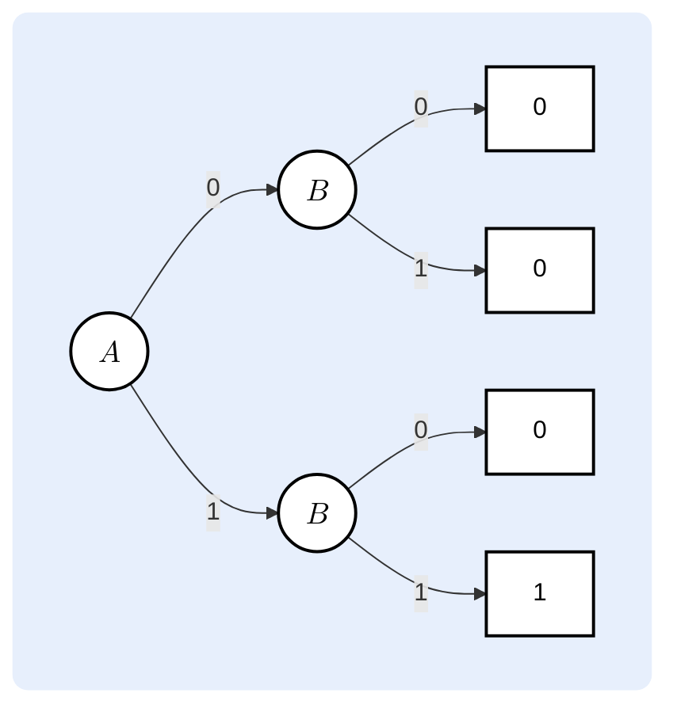

##### Содержание
1. Нормальные формы
	1. Пререквизиты
	2. Нормальные формы
		1. Определение
		2. Классификация
		3. Получение нормальных форм
		4. Бинарная диаграмма решений
2. Задача минимизации
	1. Мотивация
	2. Алгебраические методы минимизации
	3. Карты Карно
		1. Диаграммы Вейча
		2. Общие представления
		3. Минимизация при помощи карт Карно
		4. Многомерные карты Карно
		5. Don't-care условие
	4. Метод Петрика и алгоритм Куайна — Мак-Класки

---

$$\hspace{12cm}
\begin{array}{r}
\textit{"— Это Красти Краб?} \\
\textit{— Нет, это Патрик!"} \\
	\text{— С. Р. Петрик}
\\[-0.8em]
\rule{7cm}{0.3pt}
\end{array}  $$
# Нормальные формы

## Пререквизиты

> [!Info] Определение
> **Литерал** — переменная или её отрицание.
> 
> Любое булево выражение составляется из литералов и простых бинарных операций.

> [!Info] Определение
> Конъюнкция литералов называется **конъюнктом** (также *cube*).
> Конъюнкт истинен тогда и только тогда, когда истинен каждый из входящих в него литералов.
> 
> Дизъюнкция литералов называется **дизъюнктом** (также *clause*).
> Дизъюнкт истинен тогда и только тогда, когда истинен хотя бы один из входящих в него литералов.

> [!Info] Определение
> Для любого набора из $n$ булевых переменных:
> - **Минтерм** $m$ — максимальный *конъюнкт*, включающий в себя все переменные.
>   Каждый минтерм принимает истинное значение только при одной комбинации значений переменных.
> - **Макстерм** $M$ — максимальный *дизъюнкт*, включающий в себя все переменные.
>   Каждый макстерм принимает ложное значение только при одной комбинации значений переменных.

> [!Important] Замечание
> Минтермы и макстермы можно *индексировать*: $i$-й из них будет выражаться через $i$-ю строку в таблице истинности: $$\begin{array}{c|ccc|cc} 
> i & x & y & z & m_i & M_i \\ 
> \hline 
> 0 & 0 & 0 & 0 & \overline{x}\land\overline{y}\land\overline{z} & x\lor y \lor z \\ 
> 1 & 0 & 0 & 1 & \overline{x} \land \overline{y}\land z & x \lor y \lor \overline{z} \\
> 2 & 0 & 1 & 0 & \overline{x} \land y \land \overline{z} & x \lor \overline{y} \lor z \\
> 3 & 0 & 1 & 1 & \overline{x} \land y \land z & x \lor \overline{y} \lor \overline{z} \\
> 4 & 1 & 0 & 0 & x \land \overline{y} \land \overline{z} & \overline{x} \lor y \lor z \\
> 5 & 1 & 0 & 1 & x \land \overline{y} \land z & \overline{x} \lor y \lor \overline{z} \\
> 6 & 1 & 1 & 0 & x \land y \land \overline{z} & \overline{x} \lor \overline{y} \lor z \\ 
> 7 & 1 & 1 & 1 & x \land y \land z & \overline{x} \lor \overline{y} \lor \overline{z}
> \end{array}$$
> 
> $M_0 = x \lor y \lor z$, поскольку $M_0 = 0$ только при $x = 0, y = 0, z = 0$!

> [!Info] Определение
> **Импликанта** функции $f$ — функция $g$ такая, что $$g(x_1, x_2, \dots, x_n) = 1 \implies f(x_1, x_2, \dots, x_n) = 1 $$
> ![[Drawing 2025-11-25 19.42.14.excalidraw.png|500]]

> **Простые импликанты**
> 
> Импликанта называется *простой* (*prime*), если:
> - она является кубом;
> - она не поглощается ни одной другой импликантой, являющейся кубом.
> 
> ![[Drawing 2025-11-25 19.54.20.excalidraw.png]]

> **Ядерные импликанты**
> 
> Импликанта называется *ядерной* (*essential*), если:
> - она является простой;
> - существует минтерм исходной функции, который возможно покрыть только этой импликантой.
> 
> ![[Drawing 2025-11-25 20.09.09.excalidraw.png|500]]

## Нормальные формы

> [!Info] Определение
> Форма записи булева выражения, удовлетворяющая определенным условиям, называется его **нормальной формой**.
> 
> Если нормальная форма выражения единственна, она называется *канонической*.

### Классификация нормальных форм

	ㅤ

> **Отрицательная нормальная форма**
> 
> Булево выражение находится в *отрицательной нормальной форме* (*NNF*), если в нём отсутствуют сложные отрицания, которые можно было бы раскрыть при помощи законов де Моргана.

	ㅤ

> **Дизъюнктивная нормальная форма**
> 
> Булево выражение находится в *дизъюнктивной нормальной форме (DNF)*, если оно представляет собой дизъюнкцию кубов: $$f(x_1, x_2, \dots, x_n) = c_1 \lor c_2 \lor \dots \lor c_k, $$
> где $c_i$ — произвольный конъюнкт.

	ㅤ

> **Конъюнктивная нормальная форма**
> 
> Булево выражение находится в *конъюнктивной нормальной форме (CNF)*, если оно представляет собой конъюнкцию дизъюнктов: $$f(x_1, x_2, \dots, x_n) = c_1 \land c_2 \land \dots \land c_k, $$
> где $c_i$ — произвольный дизъюнкт.

	ㅤ

> **Совершенная ДНФ**
> 
> Булево выражение находится в *совершенной дизъюнктивной нормальной форме (CDNF — canonical disjunctive normal form, также SoP — sum of products)*, если оно представляет собой дизъюнкцию минтермов: $$f(x_1, x_2, \dots, x_n) = \bigvee\limits_{i \in I} m_i, ~~~ I \subseteq \{0, 1, \dots, 2^n - 1\} $$

	ㅤ

> **Cовершенная КНФ**
> 
> Булево выражение находится в *совершенной конъюнктивной нормальной форме (CCNF -— canonical conjunctive normal form, также PoS — product of sums)*, если оно представляет собой конъюнкцию макстермов: $$f(x_1, x_2, \dots, x_n) = \bigwedge\limits_{i \in I}M_i, ~~~ I = \subseteq\{0, 1, \dots, 2^n - 1\} $$

	ㅤ

> **Сокращённая ДНФ**
> 
> Булево выражение находится в *сокращённой дизъюниктивной нормальной форме (далее — СДНФ, также BCF — Blake Canonical Form*), если оно представляет собой дизъюнкцию всех простых импликант.

	ㅤ

> **Минимальная ДНФ**
> 
> Булево выражение находится в *минимальной дизъюнктивной нормальной форме* (*Minimal DNF*), если оно представляет собой дизъюнкцию таких импликант, что исключение любой из них изменяет функцию.

	ㅤ

> **Минимальная КНФ**
> 
> Булево выражение находится в *минимальной конъюнктивной нормальной форме* (*Minimal CNF*), если оно представляет собой конъюнкцию таких импликант, что исключение любой из них изменяет функцию.

	ㅤ

### Получение нормальных форм

> **Получение ДНФ/КНФ**
> 
> Чтобы получить выражение в ДНФ или КНФ, необходимо:
> 
> 1. упростить сложные операции $$\begin{gathered} x \iff y \to (x \land y) \lor (\overline{x} \land \overline{y}) \\ \\ x \implies y \to \overline{x} \lor y \\ \\ x \oplus y = (x \land \overline{y}) \lor (\overline{x} \land y) \end{gathered}$$
> 2. упростить сложные отрицания (получив NNF): $$\begin{gathered} \overline{x \lor y} = \overline{x} \land \overline{y} \\ \\ \overline{x \land y} = \overline{x} \lor \overline{y} \\ \\ \overline{\overline{x}} = x \end{gathered}$$
> 3. применить дистрибутивность: $$\begin{gathered} (x \lor y) \land z \stackrel{\text{DNF}} \longrightarrow (x \land z) \lor (y \land z) \\ \\ (x \land y) \lor z \stackrel{\text{CNF}} \longrightarrow (x \lor z) \land (y \lor z) \end{gathered}$$
> 4. упростить получившееся выражение, используя законы идентичности и дополнения.

 > **Получение СДНФ**
 >
 >Чтобы получить выражение в совершенной дизъюнктивной форме, необходимо:
> 1. найти все столбцы таблицы истинности, в которых фукнция принимает истинное значение;
> 2. записать соответствующие минтермы;
> 3. произвести их дизъюнкцию.

> **Получение СКНФ**
> 
> Чтобы получить выражение в совершенной конъюнктивной форме, необходимо:
> 1. найти все столбцы таблицы истинности, в которых фукнция принимает ложное значение;
> 2. записать соответствующие макстермы;
> 3. произвести их конъюнкцию.

> [!Important] Замечание
> 
> СДНФ и СКНФ функции можно получить путём последовательного применения к ней операции разложения Шеннона по каждой из переменных (в произвольном порядке), причём получившаяся форма зависит от операции, относительно которой разлагается функция.

### Бинарная диаграмма решений

Если рекурсивно применять разбиение Шеннона, то можно построить двоичное дерево, отражающее результаты применения функции ко всем возможным входным наборам. Такое дерево называется **бинарной диаграммой решений** (*BDD ­— Binary Decision Diagram*) и представляет собой одну из канонических форм представления функции.

Например, так выглядит бинарная диаграмма решений для функции $f(A, B) = A \land B$:

---

# Задача минимизации

## Мотивация

Мы всегда можем представить любое выражение в одной из совершенных форм, однако результат часто не будет являться минимальным, что в реальных задачах ведёт к избыточным расходам, которых хочется избежать.

> [!Important] Замечание
> «Минимальность» в этом контексте может означать:
> - минимальное количество литералов;
> - минимальное количество конъюнктов/дизъюнктов;
> - минимальное количество операций и проч.
> 
> Чаще всего мы будем апеллировать ко второй интерпретации. Иными словами, нашей задачей будет получение *минимальной* (или *сокращённой* в качестве промежуточного результата) ДНФ.

Далее будут рассмотрены основные методы решения поставленной задачи.

---

## Алгебраическая минимизация

Самый наивный способ минимизировать булевы выражения — применение аксиом и законов булевой алгебры: $$\begin{aligned} f 
&= ABC \lor AB\overline{C} \lor \overline{A}BC \lor \overline{A}\overline{B}C \\ &= AB(C \lor \overline{C}) \lor \overline{A}C(B \lor \overline{B}) &\text{дистрибутивность} \\
&= AB \land 1 \lor \overline{A}C \land 1 &\text{дополнение} \\
&= AB \lor \overline{A}C &\text{идентичность}
\end{aligned} $$
Метод получения СДНФ из совершенной ДНФ путём последовательного применения закона склеивания называется **алгоритмом Куайна**.

---

## Карты Карно

### Общие представления

> [!Info] Определение
> **Код Грея** — бинарная кодировка, в которой последовательные значения различаются ровно на один бит: $$\begin{array}{c|c} 000 & 110 \\ 001 & 111 \\ 011 & 101 \\ 010 & 100 \end{array}$$

> [!Info] Определение
> Таблица размерностью $2^{\lfloor \frac n 2 \rfloor} \times 2^{\lceil \frac n 2 \rceil}$, полученная из таблицы истинности булевой функции $f(x_1, x_2, \dots, x_n)$ путём переупорядочения ячеек в соответствии с кодом Грея, называется **картой Карно**:
> 
> ![[Drawing 2025-11-25 22.40.52.excalidraw.png|500]]
> 

> [!Important] Замечание
> Код Грея используется для упорядочения значений переменных, составляющих строку или столбец. Так, пары значений переменных $A$ и $B$ в приведенном примере составляют следующую последовательность: $$\begin{gathered} 00 \\ 01 \\ 11 \\ 10 \end{gathered}$$
> Соответственно, все переменные в первой строке будут иметь в своём составе конъюнкт $\overline{A}\overline{B}$, во второй — $\overline{A}B$ и.т.д.

> [!Warning] Важно!
> 
> Карта Карно имеет структуру *тора*: ячейки, принадлежащие её первому и последнему столбцу или первой и последней строке, также считаются соседними. В частности, углы карты также соседствуют (но не диагональные!)
### Минимизация при помощи карт Карно

Структура карты Карно позволяет перейти от алгебраической минимизации к визуальному распознаванию паттернов: соседние ячейки в ней соответствуют минтермам, к которым применим закон склеивания; более того, легко показать, что этот закон применим к целым областям ячеек.

Склеиваемые области определяются согласно следующим принципам: 
1. размер области — степень двойки;
2. область имеет прямоугольную форму;
3. область может пересекать границы таблицы;
4. бòльшие области более приоритетны.

Группы на карте Карно, состоящие только из истинных минтермов, будут соответствовать *импликантам*. Если такая группа не содержится ни в одной другой, она соответствует *простой импликанте*. Таким образом, построение СДНФ по карте Карно сводится к визуальному выделению всех простых импликант:
![[Drawing 2025-11-26 00.26.22.excalidraw.png]]

Для получения минимальной ДНФ после этого необходимо:
1. выделить ядерные импликанты (такие области, что какая-то из покрытых ими единиц покрыта только ими);
2. покрыть оставшиеся единицы минимальным количеством областей.

### Многомерные карты Карно

При составлении карт Карно для функций от пяти и более переменных конструкция несколько усложняется — соединямые клетки, то есть такие, что соответствующие минтермы отличаются ровно на одну переменную, теперь не обязаны соседствовать. 
В этом случае карту Карно можно мысленно «сворачивать» пополам, представляя её в трёхмерном виде, в результате чего склеиваемые клетки действительно будут являться соседними:

![[Drawing 2025-11-26 18.25.22.excalidraw.png]]

Впрочем, карты Карно редко используются для минимизации функций от такого числа переменных — зачастую в картах Карно их количество ограничивается четырьмя.

### Don't-care условие

При работе с булевыми функциями может возникнуть ситуация, при которой их значения при определенных наборах входных данных не имеет значения — например, если они никогда не используются или функция не вполне определена. В таблице истинности подобные комбинации помечаются $\times$ вместо $0$ или $1$. При минимизации с помощью карт Карно мы можем включать незначащие минтермы в любые группы, если необходимо, однако не можем составлять группы, целиком состоящие из них.

---
## Метод Петрика

Метод Петрика позволяет аналитически вычислить все возможные минимальные ДНФ по СДНФ. 
Алгоритм заключается в следующем:

> **1. Построение таблицы простых импликант**
> 
> Метод Петрика работает с таблицей, где строки отвечают за простые импликанты, а столбцы — за минтермы, покрываемые ими: $$\begin{array}{c|cc}  & 0 & 1 &2 & 3 & 4 & 5 & 6 & 7 \\ \hline m_1 & \checkmark & \times & \times & \checkmark & \times & \times & \checkmark & \checkmark \\ m_2 & \times & \checkmark & \times & \times & \times & \checkmark & \times & \times \\ m_3 & \times & \times & \checkmark & \checkmark & \times & \times & \times & \checkmark \\ m_4 & \checkmark & \times & \times & \times & \checkmark & \times & \times & \checkmark \\ m_5 & \times & \times & \checkmark & \times & \times & \times & \checkmark & \times\end{array}$$
> Она также называется *prime implicant chart*.

> **2. Выделение ядерных импликант**
> 
> Если какой-то из минтермов покрывается единственной импликантой (= если в столбце ровно одна галочка), то эта импликанта будет ядерной, и мы обязаны взять её в разбиение: 
> ![[Drawing 2025-11-26 09.03.47.excalidraw.png|550]]

> **3. Исключение ядерных импликант**
> 
> Следующим шагом мы исключаем из таблицы найденные ядерные импликанты и все минтермы, покрытые ими. При этом оставшимся импликантам задаются «псевдонимы»: 
> $$\begin{array}{c|cc} & 2 & 3 & 6 \\ \hline m_1 = \varphi_1 & \times & \checkmark & \checkmark \\ m_3 = \varphi_2 & \checkmark & \checkmark & \times \\ m_5 = \varphi_3 & \checkmark & \times & \checkmark \end{array}$$

> **4. Построение минимальной ДНФ**
> 
> Минимальная ДНФ включает в себя все ядерные импликанты и некоторое число таких импликант из получившейся таблицы, что их дизъюнкция покрывают все оставшиеся минтермы. Запишем, что означает «покрытие»: $$\begin{aligned} &(\varphi_2 \lor \varphi_3) &\text{минтерм 2} \\ \land &(\varphi_1 \lor \varphi_2) &\text{минтерм 3} \\ \land &(\varphi_1 \lor \varphi_3) &\text{минтерм 6} \end{aligned}$$
> Переведём это выражение в ДНФ: $$\begin{gathered} (\varphi_1 \land \varphi_2) \lor (\varphi_1 \land \varphi_3) \lor (\varphi_2 \land \varphi_3) \end{gathered}$$
> Минимальные формы получаются добавлением любого из получившихся конъюнктов к выделенным ранее ядерным импликантам: $$\begin{aligned} f &= m_2 \lor m_4 \lor (\varphi_1 \land \varphi_2) = \\ &= m_2 \lor m_4 \lor (\varphi_1 \land \varphi_3) = \\ &= m_2 \lor m_4 \lor (\varphi_2 \land \varphi_3) \end{aligned}$$

---
### Алгоритм Куайна — Мак-Класки

> [!Info] Определение
> Непосредственным приложением метода Петрика является **алгоритм Куайна ­— Мак-Класки** — табличный метод минимизации, гарантирующий нахождение минимальной ДНФ. Он проходит в два этапа:
> 1. построение СДНФ при помощи алгоритма Куайна;
> 2. построение минимальной ДНФ при помощи метода Петрика.
> 

В отличие от карт Карно, алгоритм Куайна — Мак-Класки весьма сложно проделывать вручную, однако он достаточно удобен для программирования.

---
